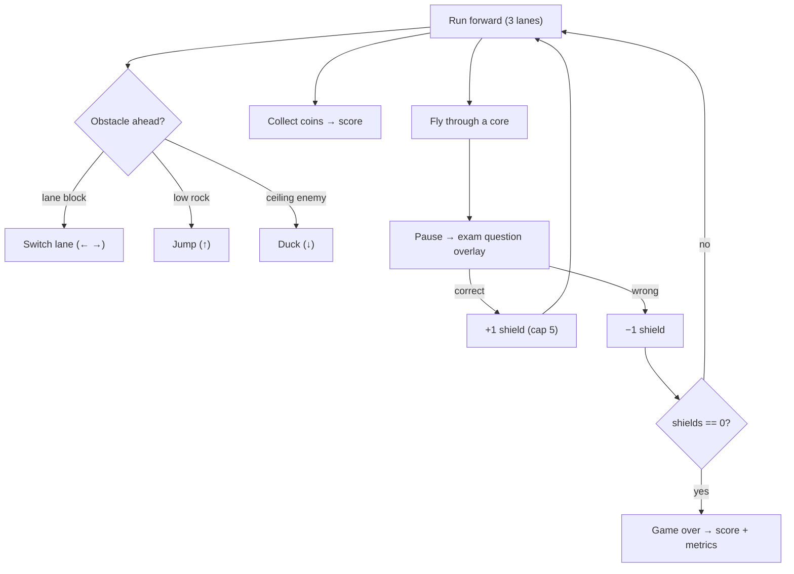

# 04 — CC · Chasm Chase

<!-- doc-version: v1.2 · baseline v1.0 = original file · MINOR (arch-to-rim + feel pass + v0.47 visual/gameplay pass notes) -->
**Doc version:** v1.2 · **Owner:** single chat · **Edited:** 2026-06-28

**Genre:** 3D endless runner (Temple Run-style), **Three.js**. **Status:** new build (Phase 3). This is the only 3D module — the rendering tech is isolated here so it can't destabilize the 2D games.

You chase the BCM squadron through a planet's chasm, flying below radar, dodging the canyon, collecting coins and cores. Collecting a core triggers an exam question that gains or costs you a shield.

---

## 1. Core loop

- Ship runs **forward** through a procedurally generated chasm; world scrolls toward the camera (chase cam behind/above the ship).
- **Lanes:** three (left / center / right). Controls move between lanes and vertically.
- **Collect coins** (score) and **cores** (trigger a question). Avoid obstacles.
- **Shields:** start with **5**. Correct answer **+1 shield** (cap 5), wrong **−1**. **0 shields → game over.**
- **Endless.** Speed ramps over time. Goal = highest score. Tracked metrics: **unique questions correct**, **incorrect**, **points**, distance.



---

## 2. Controls & player state (✅ confirmed: Subway-Surfers style)

Four actions, keyboard + touch (swipe). Like Temple Run / Subway Surfers: move between three lanes, plus a **discrete jump** and **duck** — you **cannot hold to fly/stay up**; jump is a fixed auto up-and-down arc.

| Action | Keyboard | Touch | Effect |
|--------|----------|-------|--------|
| Move left | ← / A | swipe left | shift one lane left (tween) |
| Move right | → / D | swipe right | shift one lane right |
| Jump | ↑ / W / Space | swipe up | **fixed arc** (auto rise + fall); clears **low** obstacles only during the arc; not holdable |
| Duck | ↓ / S | swipe down | lower hitbox briefly; passes under **ceiling** enemies |

```ts
interface Runner {
  lane: 0 | 1 | 2;
  jumpT: number;          // 0 = grounded; >0 advances a fixed-duration arc, then auto-lands
  ducking: boolean;       // momentary, auto-ends
  shields: number;        // 0..5
  speed: number;          // ramps with distance
  buffs: ActiveBuff[];
}
```

**"Below radar" ceiling:** ✅ **flavor only.** Since jump is a fixed short arc and you can't sustain altitude, there's nothing to breach — the radar line is a visual ceiling for atmosphere, no mechanic attached.

---

## 3. Obstacles (three types)

| Type | Avoid by | Spawns in |
|------|----------|-----------|
| **Lane block** (rock wall) | change lane | one/two of three lanes |
| **Low rock** | jump | a lane, ground height |
| **Ceiling enemy** (hovering BCM) | duck | a lane, top height |

Procedural spawner places obstacles ahead at intervals that **shorten as speed ramps**, with solvability guaranteed (never block all three lanes simultaneously in a way the player can't clear).

---

## 4. Cores, questions, power-ups

- **Cores** spawn periodically (every ~X meters / randomized, frequency tuned so questions feel "every so often," not constant).
- Flying through a core → **pause the run** → **exam question overlay** (shared QuestionProvider, randomized; difficulty may ramp slightly with distance). Correct **+1 shield**, wrong **−1**. Then resume.
- **~10% of cores are power cores:** on collect (after answering), grant a **temporary buff**:
  - **Magnet** (10s): coins pull toward the ship.
  - **Invincibility** (7s): pass through obstacles.
  - **Shield +1** (instant, within cap) / **coin ×2** (10s) / **slow-mo** (a few s, easier dodging).
- Buffs are timed and stack-safe (re-collecting refreshes duration). Every answer → `MasteryStore.record` + telemetry.

---

## 5. Tech & performance (this is the risk area)

3D perf is the main hazard. Hard requirements (also in `01 §13`, enforced by the review agent):
- **Three.js**, kinematic only (no physics engine). Lane positions are fixed x values; jump is a parabola; collisions are **AABB / sphere** checks.
- **Object pooling** for obstacles, coins, cores, and particles — **zero per-frame allocation**. Recycle off-screen objects.
- **Instanced/merged geometry** for repeated rocks/coins; low-poly assets; shared materials.
- **Capped `devicePixelRatio`**; frustum culling; fog to hide spawn pop-in and reduce draw distance.
- **Fixed-timestep** update for movement/spawning; render decoupled.
- **Pause cleanly** during the question overlay (stop RAF/update; resume without a time jump).
- **Mobile fallback:** lower draw distance / fewer particles when frame budget is tight (simple adaptive quality).

**Checklist (perf)**
- [ ] Pools for obstacles/coins/cores/particles (no GC churn in loop)
- [ ] Instanced/merged repeated geometry + shared materials
- [ ] DPR cap + fog + culling + draw-distance budget
- [ ] Fixed-timestep update; clean pause/resume around questions
- [ ] Adaptive quality on low-end

---

## 6. Scoring & metrics

- **Points** = coins + distance bonus (+ multipliers from buffs).
- Persist **best score**.
- Stats screen (shared): **unique questions correct**, **unique incorrect**, **total points**, longest run. These come from MasteryStore + telemetry, so they aggregate with the other two games.

---

## 7. Verification (CC-specific)

Headless can't measure FPS, so split verification:
- [ ] **Logic tests (jsdom, Three mocked):** spawn/recycle pooling correctness, lane-change/jump/duck state, collision math, shield gain/loss, **0-shields → game over**, buff timers expire, question overlay pause/resume, mastery writes.
- [ ] **Pooling assertion:** allocation count stable across N simulated seconds (catch leaks).
- [ ] **Solvability test:** spawner never produces an unclearable wall sequence (seeded).
- [ ] **Manual/device FPS pass** documented in CHANGELOG (the one thing automation can't fully cover); target 60fps desktop, graceful on mobile.

---

## 8. CC checklist (rollup)

**Core**
- [ ] Three.js scene, chase cam, scrolling chasm
- [ ] 3-lane movement + jump + duck (keyboard + touch) [Q8]
- [ ] Three obstacle types + guaranteed-solvable spawner
- [ ] Coins + cores; speed ramp

**Questions & buffs**
- [ ] Core → question overlay (pause/resume) via shared provider
- [ ] +1/−1 shield, cap 5, 0 → game over
- [ ] ~10% power cores: magnet / invincible / shield+ / coin× / slow-mo (timed)

**Perf (hard gates)**
- [ ] Object pooling everywhere; zero per-frame allocation
- [ ] Instancing, DPR cap, culling/fog, fixed timestep, adaptive quality

**Integration & verification**
- [ ] MasteryStore + telemetry on every answer
- [ ] Best-score persistence + shared Stats
- [ ] Logic + pooling + solvability tests green; device FPS pass logged


---

## 9. Implementation notes (added v1.1 — matches shipped `cc.js`)

The build refines the v1.0 design in several ways, all verified by `npm run check` (CC fairness 16/16):

**Player + collision heights.** `PLAYER_H` = 1.9 (standing collision top, equal to the visual ship's billboard height), `PLAYER_DUCK_H` = 0.7 (ducked top). Collision uses `topY = (ducking ? PLAYER_DUCK_H : PLAYER_H) + p.y`. Lanes: `LANE_W` 2.2, `PLAYER_HW` 0.7.

**The three obstacles** (unchanged in kind, refined in form):
- **Side-bulge wall** (`OB_NARROW`) — a craggy promontory bulging from a wall into one side; switch lane to pass.
- **Low rock** (`OB_LOWROCK`) — jump it. Rendered as a **faceted octahedron boulder** (`OctahedronGeometry(1,1)` with position-hashed vertex jitter for a watertight craggy look — guarded for the headless mock's attribute-less geometry), replacing the old box. `ROCK_H` 0.6; collision is a forgiving low band (`pLo < ROCK_H + ROCK_COLL_HW`). **Multi-lane rocks / rock+wall combos are deferred** (optional; a spawner + collision change, headlessly verifiable via the fairness check).
- **Overhead arch** (`OB_ARCH`) — a **full-width, wall-to-wall lintel you duck under** (not the v1.0 single-lane "ceiling enemy"). Underside pinned at `CEIL_BOTTOM` = 1.5; **`ARCH_H` = 2.75** so the top sits at 4.25 — a shorter overhead band (halved from an earlier 5.5 that reached the rim). Collision triggers when the standing top crosses the underside (`pHi > CEIL_BOTTOM`); ducked 0.7 clears, standing 1.9 hits. The duck window — underside between the ducked top (0.7) and standing top (1.9) — is the fairness invariant.

**Gates** are **octagonal portals** (`TorusGeometry(3.4, 0.42, 8, 8)` rotated by π/8), emissive aqua / gold for power gates — replacing square frames.

**Lane lines removed.** The blue floor lane-lines (`_buildLaneLines`) are no longer drawn; lanes read from obstacle/coin placement.

**Real shadows.** Three.js shadow mapping is on (1024 PCFSoft, ±22 frustum, `castShadow` / `receiveShadow`) — all guarded so the headless mock (no `.shadowMap`) still runs.

**`pause()` / `resume()`** are a hard freeze (sim + RAF + timers stop; resume with no time jump), per `01 §9`. The view RNG is forked separately from the sim RNG for deterministic scenery.

**Deferred (browser-blind, unblocked):** realistic mountains (`_buildPeaks`), a parallax sky, and a LUT colour grade.

---

## 10. Arch-to-rim, feel pass, and the v0.47 visual/gameplay pass (added v1.2 — matches shipped `cc.js`)

**Arch to the rim (`v0.41.0`).** `ARCH_H` 2.75→**5.3**: the duck arch's underside stays pinned at `CEIL_BOTTOM` (1.5) so duck/collision are unchanged, and its **top now sits exactly at the chasm rim** (`RIM_Y` 6.8 = 1.5 + 5.3). The documented tension stands: a duck arch can't be both short *and* reach the rim — "top at rim" forces ~5.3.

**Feel pass (`v0.43.0`, C1–C4).** Camera follows lane changes laterally, counter-rolls, and dips on landings; lane movement is a smoothstep tween with **velocity-driven bank** (no arrival snap); duck squash is eased; landings squash with a dust puff. Correction for the record: **C5 fixed timestep was already implemented** (`CONFIG.FIXED_DT` 1/120 + accumulator) — the review misread the loop.

**Visual/gameplay pass (`v0.47.0`).** `_buildPeaks` rewritten into **two overlapping craggy ridge rows per side** (per side: 9 sharp near peaks h 7–19 + 6 taller hazed far silhouettes h 16–30, position-hash `crag()` jitter) — a mountain horizon, not traffic cones. Gates became **hex rings** (`TorusGeometry(3.4, 0.30, 4, 6)`, flat-top) with **additive energy films** pulsing at `0.10 + 0.10·sin(t·7.3)`. The jump obstacle is now the arch's mirror — a **full-width wall** (`ROCK_H` 0.6→**1.25**, lane-independent collision `pLo < ROCK_H`, the same `M.rock` slab as the arch; combo row = narrowing + wall, survivable by moving off the sealed lane AND jumping). **Bobbing chevron telegraphs**: gold UP cones over walls, aqua DOWN cones in duck gaps — colorblind-safe by shape+color. Framing: `CAM.chaseLook` y 1.2→**0.35**, z −18→**−14** (ship sits higher in frame). Duck: sink **0.10**, squash **0.30**, plus a **nose-down pitch** `0.22·_duckF` (dive-under read, not deflate). `ccBumps` is retired and `_bumpMat` removed — the wall shares the arch texture.

**Fairness.** The checker held through the pass with zero rule changes, then the wall contract was pinned: **20/20** (all-lane standing hit at `topY` 1.9, all-lane jump clear).

## Change history

- **v1.2 (2026-06-28)** — Added §10: the `v0.41` arch-to-rim change (`ARCH_H` 5.3, top at `RIM_Y`; supersedes §9's 2.75), the `v0.43` feel pass C1–C4 (+ the C5 fixed-timestep correction), and the full `v0.47` pass (craggy two-row `_buildPeaks`, hex gates + pulsing energy films, the full-width jump **wall** with lane-independent collision replacing the boulder, chevron telegraphs, `chaseLook` reframe, duck nose-pitch; `ccBumps`/`_bumpMat` retired). Fairness pinned 20/20. No contract or bank change.

- **v1.1 (2026-06-28)** — Added §9 Implementation notes to match the shipped `cc.js`: player/collision heights (`PLAYER_H` 1.9 / `PLAYER_DUCK_H` 0.7, `topY` collision), the **full-width duck arch** (`OB_ARCH`, underside at `CEIL_BOTTOM` 1.5, `ARCH_H` 2.75 → top 4.25, halved from 5.5; collision `pHi > CEIL_BOTTOM`), **faceted octahedron boulder** low rocks (was a box; multi-lane combos deferred), **octagonal gates** (`TorusGeometry 3.4/0.42/8/8`), **removed blue lane lines**, **real Three.js shadows** (guarded), and `pause()`/`resume()` hard freeze. Deferred: realistic mountains, parallax sky, LUT grade. All browser-blind (visual-pass debt); structural gate green (`npm run check` 284/284, CC fairness 16/16). No contract or question-bank change.
- **v1.0** — baseline (original `04_CC_chasm_chase.md`): the CC design + checklists (core loop, controls, obstacles, cores/power-ups, tech/perf, scoring, verification).
